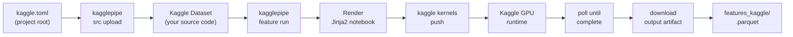

# kagglepipe

Full terminal control over [Kaggle](https://www.kaggle.com). A thin, configurable
orchestrator on top of the official `kaggle` CLI — so you can do 100% of your
Kaggle work from the shell, not a browser.

```bash
pip install -e . && kagglepipe --help
```

## The problem

The official `kaggle` CLI is great at one thing: raw API calls.
Everything else — notebook templating, kernel lifecycle management,
sequential multi-branch runs, output artifact handling — is manual
clicking in the Kaggle web UI.

**kagglepipe** sits on top of the CLI and adds the workflow layer:

- Per-project `kaggle.toml` — no hard-coded slugs, branch lists, or paths
- Jinja2 notebook templates — generate parameterized `.ipynb` files per branch
- Source dataset auto-versioning — knows when to `create` vs `version`
- End-to-end pipeline — render → push → poll → download in one command
- Sequential multi-branch orchestration — `feature all`
- Cross-platform UTF-8 safety — no crashes on Windows `cp1252` consoles

## How it works



A typical session:

```bash
# configure once
kagglepipe config init --name myproj
$EDITOR kaggle.toml

# upload source (auto version-bumps)
kagglepipe src upload

# run features on Kaggle GPU
kagglepipe feature run dinov3 --gpu t4x2
kagglepipe feature all

# check results
kagglepipe status
kagglepipe kernels logs user/myproj-dinov3
```

## Install

```bash
git clone https://github.com/AdityaProCoder/kagglepipe && cd kagglepipe
python -m venv .venv
.venv\Scripts\python.exe -m pip install -e ".[dev]"   # Windows
.venv/bin/python -m pip install -e ".[dev]"           # Linux/macOS

kagglepipe --version        # -> kagglepipe 0.1.0
kagglepipe whoami           # verify credentials
```

Credentials via `~/.kaggle/kaggle.json`, or set `KAGGLE_USERNAME` / `KAGGLE_KEY` env vars.

## Config

Create `kaggle.toml` in your project root:

```toml
[project]
name = "myproj"

[source]
include = ["src", "scripts", "pyproject.toml"]
exclude_dirs = [".venv", "data", "models", ".git", "__pycache__"]
exclude_exts = [".parquet", ".lgb", ".pt", ".bin"]
src_dataset_slug = "{username}/myproj-src"

[data]
dataset_slug = "{username}/myproj-data"

[feature]
branches = ["branch-a", "branch-b"]
heavy_branches = ["branch-b"]
default_gpu = "t4x2"
kernel_slug_template = "{username}/myproj-{branch}"
kernel_title_prefix = "myproj"
notebook_command = "python scripts/run.py --out {out_dir}"
output_glob = "{branch}.parquet"

[kernels]
is_private = true
enable_internet = true

[paths]
notebooks_dir = "kaggle_notebooks"
features_dir  = "features_kaggle"
```

Every field accepts env-var overrides: `KAGGLEPIPE_<SECTION>__<FIELD>`
(e.g. `KAGGLEPIPE_FEATURE__DEFAULT_GPU=p100`).

> **Mount path note:** Kaggle mounts datasets at
> `/kaggle/input/datasets/<username>/<name>/` — the default mount paths
> already encode this correctly.

## Full command tree

| Command | What it does |
|---|---|
| `kagglepipe whoami` | Print verified username |
| `kagglepipe login` | Bootstrap `~/.kaggle/kaggle.json` |
| `kagglepipe config init` | Scaffold `kaggle.toml` |
| `kagglepipe config show [--json]` | Print effective config |
| `kagglepipe src upload [--version N]` | Package & push source dataset |
| `kagglepipe feature run <branch> [--gpu t4x2\|p100\|none] [--timeout SEC]` | Run one branch |
| `kagglepipe feature all [--branches a,b] [--gpu X]` | Run multiple branches sequentially |
| `kagglepipe status [--all] [--csv]` | List your kernels |
| `kagglepipe kernels list [--user U] [--search S]` | List kernels |
| `kagglepipe kernels status <slug>` | Kernel live status |
| `kagglepipe kernels output <slug>` | Download kernel output |
| `kagglepipe kernels logs <slug>` | Print logs URL |
| `kagglepipe kernels stop <slug>` | Cancel a running kernel |
| `kagglepipe datasets list [--user U]` | List datasets |
| `kagglepipe datasets get <slug> <path>` | Download a dataset |
| `kagglepipe datasets create <dir> [--public]` | Create a dataset |
| `kagglepipe datasets version <dir> -m "msg"` | New version of a dataset |
| `kagglepipe competitions list` | Active competitions |
| `kagglepipe competitions submit <comp> <file> -m "msg"` | Submit to a competition |
| `kagglepipe competitions leaderboard <comp>` | Leaderboard |

Run `kagglepipe <cmd> --help` for all flags.

## Project layout

```
src/kagglepipe/
  cli.py              argparse root + dispatch
  config.py           kaggle.toml loader + env overrides
  credentials.py      ~/.kaggle/kaggle.json + KAGGLE_USERNAME/KEY
  runner.py          subprocess wrapper (UTF-8 safe, `python -X utf8 -m kaggle`)
  slug.py            {username}/{branch} template resolver
  tarball.py         build_tarball(include, exclude_dirs, exclude_exts)
  notebook.py        render Jinja2 notebook + kernel-metadata.json
  polling.py         poll_kernel_status(...)
  kaggle_api.py      high-level wrappers around the kaggle CLI
  commands/           one module per command group
  templates/         default notebook template
tests/               80 unit tests + 1 live integration test
docs/quickstart.md   step-by-step walkthrough
```

See `docs/quickstart.md` for the full guide.

## License

MIT
